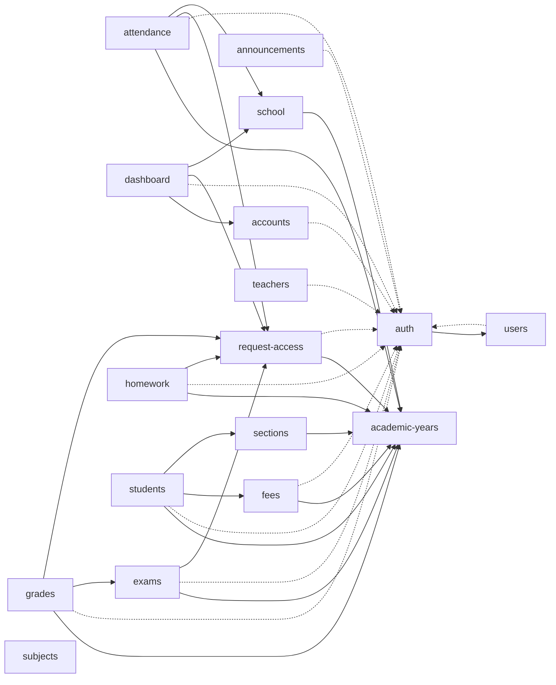

<!-- GENERATED by scripts/agents/build.mjs — do not edit; run `pnpm agents:build`. -->

# Service Catalog

Everything here is extracted from `src/` and `prisma/schema/` by the TypeScript compiler API. Nothing comes from documentation.

Solid arrow = runtime dependency (module import / service injection). Dashed = type/contract only.
`platform` (prisma + health) is infrastructure used by every module and is omitted from the graph.

| Agent | Paths | Routes | Depends on | Used by | Unit test cases |
|---|---|---|---|---|---|
| `svc-academic-years` | `src/modules/academic-years/` | 10 | platform | attendance, exams, fees, grades, homework, request-access, school, sections, students | 2 (stub) |
| `svc-accounts` | `src/modules/accounts/` | 16 | auth, platform | dashboard | 0 |
| `svc-announcements` | `src/modules/announcements/` | 5 | auth, platform | — | 0 |
| `svc-attendance` | `src/modules/attendance/` | 5 | academic-years, auth, platform, request-access, school | — | 2 (stub) |
| `svc-auth` | `src/modules/auth/` | 6 | platform, users | accounts, announcements, attendance, dashboard, exams, fees, grades, homework, request-access, students, teachers, users, src/common | 2 (stub) |
| `svc-dashboard` | `src/modules/dashboard/` | 1 | accounts, auth, platform, request-access, school | — | 0 |
| `svc-exams` | `src/modules/exams/` | 10 | academic-years, auth, platform, request-access | grades | 0 |
| `svc-fees` | `src/modules/fees/` | 9 | academic-years, auth, platform | students | 0 |
| `svc-grades` | `src/modules/grades/` | 4 | academic-years, auth, exams, platform, request-access | — | 0 |
| `svc-homework` | `src/modules/homework/` | 5 | academic-years, auth, platform, request-access | — | 0 |
| `svc-platform` | `src/modules/health/` `src/modules/prisma/` | 1 | — | academic-years, accounts, announcements, attendance, auth, dashboard, exams, fees, grades, homework, request-access, school, sections, students, subjects, teachers, users, src/common | 0 |
| `svc-request-access` | `src/modules/request-access/` | 10 | academic-years, auth, platform | attendance, dashboard, exams, grades, homework | 2 (stub) |
| `svc-school` | `src/modules/school/` | 5 | academic-years, platform | attendance, dashboard | 2 (stub) |
| `svc-sections` | `src/modules/sections/` | 4 | academic-years, platform | students | 2 (stub) |
| `svc-students` | `src/modules/students/` | 7 | academic-years, auth, fees, platform, sections | — | 2 (stub) |
| `svc-subjects` | `src/modules/subjects/` | 5 | platform | — | 2 (stub) |
| `svc-teachers` | `src/modules/teachers/` | 6 | auth, platform | — | 2 (stub) |
| `svc-users` | `src/modules/users/` | 8 | auth, platform | auth | 2 (stub) |

## Route & access matrix (prefix `/api/v1`)

Guards only check roles. Per-record access (class or subject teacher, approved access requests, ownership) is enforced inside the services; see each `svc-*` agent.

| Service | Method | Path | Roles |
|---|---|---|---|
| academic-years | POST | `/academic-years` | ADMIN |
| academic-years | GET | `/academic-years` | ADMIN |
| academic-years | GET | `/academic-years/current` | any auth |
| academic-years | GET | `/academic-years/:id` | ADMIN |
| academic-years | PATCH | `/academic-years/:id` | ADMIN |
| academic-years | PATCH | `/academic-years/:id/set-current` | ADMIN |
| academic-years | POST | `/academic-years/:id/terms` | ADMIN |
| academic-years | GET | `/academic-years/:id/terms` | any auth |
| academic-years | PATCH | `/academic-years/:id/terms/:termId` | ADMIN |
| academic-years | DELETE | `/academic-years/:id/terms/:termId` | ADMIN |
| accounts | GET | `/accounts/summary` | ADMIN |
| accounts | POST | `/accounts/deposits` | ADMIN |
| accounts | GET | `/accounts/deposits` | ADMIN |
| accounts | GET | `/accounts/deposits/:id` | ADMIN |
| accounts | PATCH | `/accounts/deposits/:id` | ADMIN |
| accounts | DELETE | `/accounts/deposits/:id` | ADMIN |
| accounts | POST | `/accounts/withdrawals` | ADMIN |
| accounts | GET | `/accounts/withdrawals` | ADMIN |
| accounts | GET | `/accounts/withdrawals/:id` | ADMIN |
| accounts | PATCH | `/accounts/withdrawals/:id` | ADMIN |
| accounts | DELETE | `/accounts/withdrawals/:id` | ADMIN |
| accounts | POST | `/accounts/bills` | ADMIN |
| accounts | GET | `/accounts/bills` | ADMIN |
| accounts | GET | `/accounts/bills/:id` | ADMIN |
| accounts | PATCH | `/accounts/bills/:id` | ADMIN |
| accounts | DELETE | `/accounts/bills/:id` | ADMIN |
| announcements | POST | `/announcements` | ADMIN |
| announcements | GET | `/announcements` | ADMIN, TEACHER, STUDENT |
| announcements | GET | `/announcements/:id` | ADMIN, TEACHER, STUDENT |
| announcements | PATCH | `/announcements/:id` | ADMIN |
| announcements | DELETE | `/announcements/:id` | ADMIN |
| attendance | PUT | `/attendance/sections/:sectionId/days/:date` | ADMIN, TEACHER |
| attendance | GET | `/attendance/sections/:sectionId/days/:date` | ADMIN, TEACHER |
| attendance | DELETE | `/attendance/sections/:sectionId/days/:date` | ADMIN, TEACHER |
| attendance | GET | `/attendance/student/:studentId` | ADMIN, TEACHER, STUDENT |
| attendance | GET | `/attendance/summary` | ADMIN, TEACHER |
| auth | POST | `/auth/login` | PUBLIC |
| auth | POST | `/auth/refresh` | PUBLIC |
| auth | POST | `/auth/logout` | any auth |
| auth | POST | `/auth/change-password` | PUBLIC |
| auth | POST | `/auth/admin/reset-password` | ADMIN |
| auth | GET | `/auth/me` | any auth |
| dashboard | GET | `/dashboard` | any auth |
| exams | POST | `/exams` | ADMIN |
| exams | GET | `/exams` | ADMIN, TEACHER, STUDENT |
| exams | GET | `/exams/:id` | ADMIN, TEACHER, STUDENT |
| exams | PATCH | `/exams/:id` | ADMIN |
| exams | POST | `/exams/:id/subjects` | ADMIN |
| exams | PATCH | `/exams/:id/subjects/:subjectId` | ADMIN |
| exams | DELETE | `/exams/:id/subjects/:subjectId` | ADMIN |
| exams | POST | `/exams/:id/finalize` | ADMIN |
| exams | POST | `/exams/:id/unlock` | ADMIN |
| exams | POST | `/exams/:id/discard` | ADMIN |
| fees | POST | `/fees/structures` | ADMIN |
| fees | GET | `/fees/structures` | ADMIN |
| fees | PATCH | `/fees/structures/:id` | ADMIN |
| fees | POST | `/fees/backfill` | ADMIN |
| fees | GET | `/fees/records` | ADMIN, STUDENT |
| fees | GET | `/fees/records/:id` | ADMIN, STUDENT |
| fees | POST | `/fees/records/:id/payments` | ADMIN |
| fees | GET | `/fees/records/:id/payments` | ADMIN, STUDENT |
| fees | GET | `/fees/student/:studentId` | ADMIN, STUDENT |
| grades | POST | `/exams/:examId/subjects/:subjectId/grades` | ADMIN, TEACHER |
| grades | GET | `/exams/:examId/subjects/:subjectId/grades` | ADMIN, TEACHER, STUDENT |
| grades | GET | `/exams/:examId/subjects/:subjectId/grades/summary` | ADMIN, TEACHER |
| grades | GET | `/grades/student/:studentId` | ADMIN, TEACHER, STUDENT |
| homework | POST | `/homework` | ADMIN, TEACHER |
| homework | GET | `/homework` | ADMIN, TEACHER, STUDENT |
| homework | GET | `/homework/:id` | ADMIN, TEACHER, STUDENT |
| homework | PATCH | `/homework/:id` | ADMIN, TEACHER |
| homework | DELETE | `/homework/:id` | ADMIN, TEACHER |
| platform | GET | `/health` | PUBLIC |
| request-access | POST | `/request-access` | TEACHER |
| request-access | GET | `/request-access/mine` | TEACHER |
| request-access | PATCH | `/request-access/:id/cancel` | TEACHER |
| request-access | GET | `/request-access` | ADMIN |
| request-access | POST | `/request-access/grants` | ADMIN |
| request-access | GET | `/request-access/sections/:sectionId/subjects/:subjectId` | ADMIN |
| request-access | PATCH | `/request-access/:id/approve` | ADMIN |
| request-access | PATCH | `/request-access/:id/reject` | ADMIN |
| request-access | PATCH | `/request-access/:id/revoke` | ADMIN |
| request-access | GET | `/request-access/:id` | ADMIN, TEACHER |
| school | GET | `/school/settings` | ADMIN |
| school | PATCH | `/school/settings` | ADMIN |
| school | POST | `/school/holidays` | ADMIN |
| school | GET | `/school/holidays` | any auth |
| school | DELETE | `/school/holidays/:id` | ADMIN |
| sections | POST | `/sections` | ADMIN |
| sections | GET | `/sections` | any auth |
| sections | GET | `/sections/:id` | any auth |
| sections | PATCH | `/sections/:id` | ADMIN |
| students | POST | `/students/promote` | ADMIN |
| students | GET | `/students` | ADMIN, TEACHER, STUDENT |
| students | GET | `/students/:id` | ADMIN, TEACHER, STUDENT |
| students | PATCH | `/students/:id` | ADMIN |
| students | POST | `/students/:id/enroll` | ADMIN |
| students | GET | `/students/:id/enrollments` | ADMIN, STUDENT |
| students | PATCH | `/students/:id/enrollments/:enrollmentId` | ADMIN |
| subjects | POST | `/subjects` | ADMIN |
| subjects | GET | `/subjects` | any auth |
| subjects | GET | `/subjects/:id` | any auth |
| subjects | PATCH | `/subjects/:id` | ADMIN |
| subjects | DELETE | `/subjects/:id` | ADMIN |
| teachers | GET | `/teachers` | ADMIN |
| teachers | GET | `/teachers/:id` | ADMIN, TEACHER |
| teachers | PATCH | `/teachers/:id` | ADMIN |
| teachers | POST | `/teachers/:id/assignments` | ADMIN |
| teachers | GET | `/teachers/:id/assignments` | ADMIN, TEACHER |
| teachers | DELETE | `/teachers/:id/assignments/:assignmentId` | ADMIN |
| users | POST | `/users/admin` | ADMIN |
| users | POST | `/users/teacher` | ADMIN |
| users | POST | `/users/student` | ADMIN |
| users | GET | `/users` | ADMIN |
| users | GET | `/users/:id` | ADMIN |
| users | PATCH | `/users/:id` | ADMIN |
| users | PATCH | `/users/:id/deactivate` | ADMIN |
| users | PATCH | `/users/:id/activate` | ADMIN |

## Knowledge freshness

`fresh` means the notes were verified against exactly this code. `stale`/`unstamped` means verify against the code, update the notes, then run `pnpm agents:stamp <service>`.

| Agent | Source hash | Notes |
|---|---|---|
| `svc-academic-years` | `fa279241b457` | fresh |
| `svc-accounts` | `a85f2fe68383` | fresh |
| `svc-announcements` | `7367046f8f81` | fresh |
| `svc-attendance` | `34aeb3cce743` | fresh |
| `svc-auth` | `8e5d6b00aee1` | fresh |
| `svc-dashboard` | `a95601de28e2` | fresh |
| `svc-exams` | `984a5f9f790d` | fresh |
| `svc-fees` | `30b8e9b3c024` | fresh |
| `svc-grades` | `c8a81174e83d` | fresh |
| `svc-homework` | `58534fe0f524` | fresh |
| `svc-platform` | `b9ca283ca3b1` | fresh |
| `svc-request-access` | `263fefb5629b` | fresh |
| `svc-school` | `400bba16c200` | fresh |
| `svc-sections` | `ae8bc8de20b8` | fresh |
| `svc-students` | `7202c2c81625` | fresh |
| `svc-subjects` | `12f8b01e3cbd` | fresh |
| `svc-teachers` | `6a9c9b4b9daf` | fresh |
| `svc-users` | `d120fb4f418e` | fresh |
