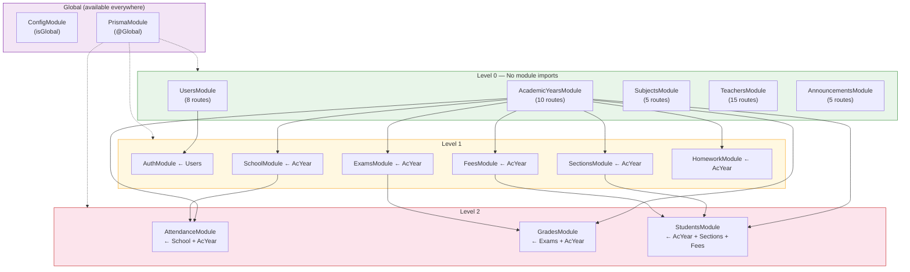

# Dependency Analysis

## Internal Dependency Graph

## External Dependency Criticality

### Critical Path Dependencies
These packages, if broken, would prevent the application from starting:

| Package | Role | Alternatives |
|---------|------|-------------|
| @nestjs/core + common | Framework | None (core to architecture) |
| @prisma/client + adapter-pg | ORM | TypeORM, Drizzle, Knex |
| passport + passport-jwt | Auth | Custom JWT implementation |
| bcrypt | Password hashing | argon2, scrypt |
| pg | DB driver | postgres.js |

### Non-Critical Dependencies

| Package | Role | Impact if Removed |
|---------|------|-------------------|
| @nestjs/swagger | API docs | No docs in dev, no production impact |
| @nestjs/terminus | Health check | Custom health check needed |
| date-fns | Date math | Could use native Date/Intl APIs |
| zod | Env validation | Fall back to manual checks |
| helmet | Security headers | Manual header setting |
| @nestjs/axios | HTTP client | **Unused — safe to remove** |

## Dependency Freshness

All dependencies are on current major versions. No EOL or deprecated packages detected.

| Category | Status |
|----------|--------|
| NestJS ecosystem (11.x) | **Latest** — NestJS 11 released 2025 |
| Prisma (7.x) | **Latest** — Prisma 7 released 2025 |
| TypeScript (5.7) | **Current** |
| Jest (30.x) | **Latest** |
| ESLint (9.x) | **Latest** (flat config) |

### Version Mismatch
- `jest@30.0.0` + `ts-jest@29.2.5`: ts-jest 29 may not fully support Jest 30 APIs. Monitor for ts-jest 30.x release.

## Transitive Dependency Concerns

The application uses `@prisma/adapter-pg` which depends on the `pg` package. This introduces:
- Native binary dependency (pg-native optional)
- Connection pool management handled by Prisma, not directly configurable

No other significant transitive dependency concerns identified.
