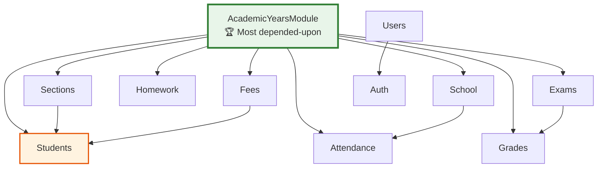
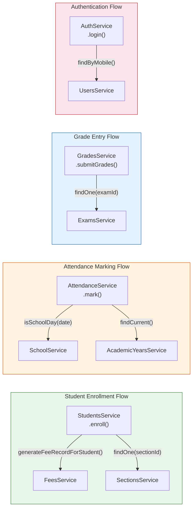

# Components

## Module Architecture

The application consists of 16 NestJS modules. Each feature module follows a consistent pattern: **Module → Controller → Service → PrismaService**.

### Infrastructure Modules

| Module | Path | Responsibility | Scope |
|--------|------|----------------|-------|
| **PrismaModule** | `src/modules/prisma/` | Database client lifecycle (connect/disconnect) | `@Global` — available everywhere |
| **HealthModule** | `src/modules/health/` | Health check endpoint (`/health`) | Imports TerminusModule |
| **ConfigModule** | (NestJS built-in) | Environment config (`app`, `jwt` namespaces) | `isGlobal: true` |

### Feature Modules

| Module | Path | Domain | Routes | Exports |
|--------|------|--------|--------|---------|
| **AuthModule** | `src/modules/auth/` | Authentication, token management | 6 | AuthService |
| **UsersModule** | `src/modules/users/` | User CRUD, role creation | 8 | UsersService |
| **AcademicYearsModule** | `src/modules/academic-years/` | Academic year + term lifecycle | 10 | AcademicYearsService |
| **SectionsModule** | `src/modules/sections/` | Class/section management | 4 | SectionsService |
| **SubjectsModule** | `src/modules/subjects/` | Subject catalog | 5 | SubjectsService |
| **TeachersModule** | `src/modules/teachers/` | Teacher profiles, permissions, class assignments | 15 | TeachersService |
| **StudentsModule** | `src/modules/students/` | Student profiles, enrollment, promotion | 7 | StudentsService |
| **AttendanceModule** | `src/modules/attendance/` | Daily attendance marking + summary | 4 | AttendanceService |
| **ExamsModule** | `src/modules/exams/` | Exam creation, finalization, discarding | 10 | ExamsService |
| **GradesModule** | `src/modules/grades/` | Grade entry, reporting, history | 4 | GradesService |
| **HomeworkModule** | `src/modules/homework/` | Homework assignments | 5 | HomeworkService |
| **AnnouncementsModule** | `src/modules/announcements/` | School announcements | 5 | AnnouncementsService |
| **FeesModule** | `src/modules/fees/` | Fee structures, records, payments | 9 | FeesService |
| **SchoolModule** | `src/modules/school/` | School settings + holidays | 5 | SchoolService |

### Shared Infrastructure (`src/common/`)

| Component | Path | Responsibility |
|-----------|------|----------------|
| **Constants** | `common/constants/app.constants.ts` | All app constants: pagination, JWT TTL, permissions, error messages |
| **@Public** | `common/decorators/public.decorator.ts` | Marks routes as unauthenticated |
| **@CurrentUser** | `common/decorators/current-user.decorator.ts` | Extracts JWT payload from request |
| **@Roles** | `common/decorators/roles.decorator.ts` | Sets required roles metadata |
| **@Permissions** | `common/decorators/permissions.decorator.ts` | Sets required permissions metadata |
| **GlobalExceptionFilter** | `common/filters/http-exception.filter.ts` | Catches all exceptions, handles Prisma P2002/P2025 |
| **JwtAuthGuard** | `common/guards/jwt-auth.guard.ts` | Global auth guard (Passport JWT) |
| **JwtStrategy** | `common/guards/jwt.strategy.ts` | Validates access tokens, loads user |
| **JwtFirstLoginStrategy** | `common/guards/jwt-first-login.strategy.ts` | Validates first_login tokens |
| **JwtChangePasswordGuard** | `common/guards/jwt-change-password.guard.ts` | Accepts both access + first_login tokens |
| **RolesGuard** | `common/guards/roles.guard.ts` | Enforces @Roles metadata |
| **PermissionsGuard** | `common/guards/permissions.guard.ts` | Enforces @Permissions metadata (ADMIN bypasses) |
| **ResponseInterceptor** | `common/interceptors/response.interceptor.ts` | Standard `{ success, data }` envelope |
| **Password Utils** | `common/utils/password.util.ts` | bcrypt hash/compare, SHA-256 token hashing |

## Module Interactions

### Cross-Module Dependencies

**Key dependency facts**:
- `AcademicYearsModule` is imported by **8 modules** — it provides `findCurrent()` which most operations need
- `StudentsModule` imports 3 modules (AcademicYears, Sections, Fees) — heaviest consumer
- `GradesModule` imports ExamsModule + AcademicYearsModule
- `AuthModule` imports UsersModule + JwtModule
- `AttendanceModule` imports SchoolModule (for `isSchoolDay()`) + AcademicYearsModule

### Data Flow Between Modules

| Source Module | Target Module | Interaction |
|---------------|---------------|-------------|
| Students → Fees | `FeesService.generateFeeRecordForStudent()` | Called during enrollment and promotion |
| Attendance → School | `SchoolService.isSchoolDay()` | Validates date before marking attendance |
| Attendance → AcademicYears | `AcademicYearsService.findCurrent()` | Gets current academic year |
| Grades → Exams | `ExamsService.findOne()` | Validates exam exists and is active |
| Auth → Users | `UsersService.findByMobile()`, `findById()` | User lookup during login/token validation |
