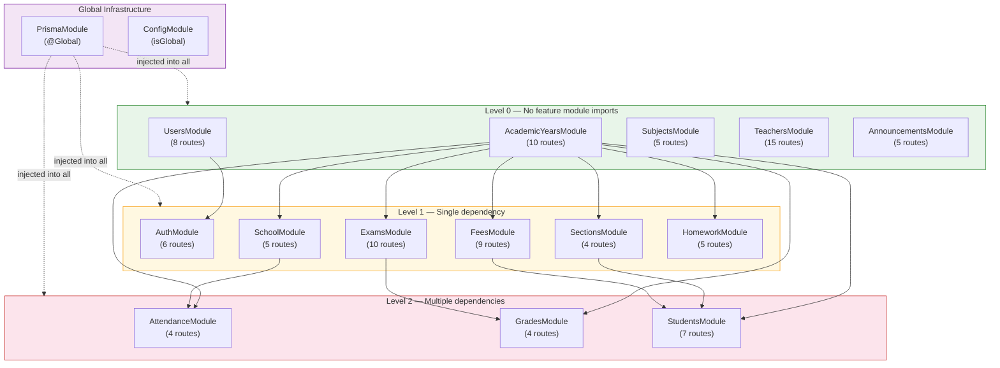
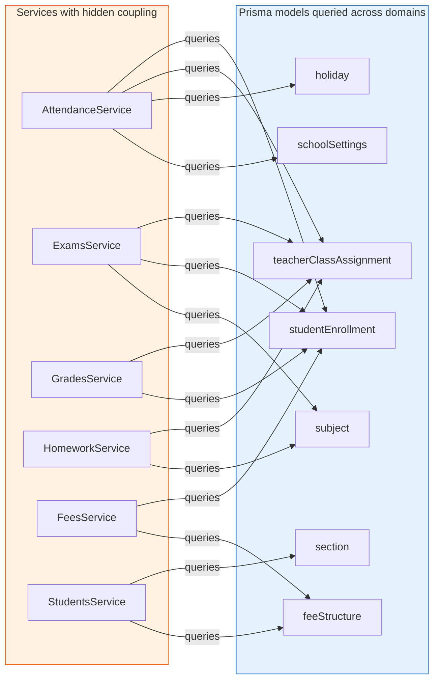

# Dependencies

## Internal Module Dependencies

### Module Dependency Graph

### Dependency Matrix

| Module | Depends On | Depended On By |
|--------|-----------|----------------|
| PrismaModule (@Global) | — | All 14 feature modules |
| ConfigModule (isGlobal) | — | Auth, PrismaService, main.ts |
| AcademicYearsModule | — | Attendance, Exams, Fees, Grades, Homework, School, Sections, Students |
| SchoolModule | AcademicYears | Attendance |
| UsersModule | — | Auth |
| AuthModule | Users, JwtModule | — |
| SectionsModule | AcademicYears | Students |
| FeesModule | AcademicYears | Students |
| ExamsModule | AcademicYears | Grades |
| GradesModule | Exams, AcademicYears | — |
| AttendanceModule | School, AcademicYears | — |
| HomeworkModule | AcademicYears | — |
| AnnouncementsModule | — | — |
| SubjectsModule | — | — |
| TeachersModule | — | — |
| StudentsModule | AcademicYears, Sections, Fees | — |
| HealthModule | TerminusModule | — |

### Implicit Dependencies (via PrismaService)

While modules declare explicit NestJS imports, many services have **implicit coupling** through shared Prisma models:

| Service | Queries Models From Other Domains |
|---------|-----------------------------------|
| AttendanceService | `studentEnrollment`, `teacherClassAssignment`, `holiday`, `schoolSettings` |
| ExamsService | `teacherClassAssignment`, `studentEnrollment`, `subject` |
| GradesService | `teacherClassAssignment`, `studentEnrollment` |
| HomeworkService | `teacherClassAssignment`, `subject` |
| FeesService | `studentEnrollment`, `feeStructure` |
| StudentsService | `section`, `feeStructure` |

**INFERENCE**: The lack of a repository layer means these cross-domain queries are embedded in service logic, creating hidden coupling that module imports don't reveal.

## External Dependencies — Runtime

| Package | Version | Purpose | Criticality |
|---------|---------|---------|-------------|
| `@nestjs/common` | ^11.0.1 | Core framework decorators, pipes, guards | Critical |
| `@nestjs/core` | ^11.0.1 | Core framework runtime | Critical |
| `@nestjs/platform-express` | ^11.0.1 | Express HTTP adapter | Critical |
| `@nestjs/config` | ^4.0.3 | Configuration management | Critical |
| `@nestjs/jwt` | ^11.0.2 | JWT token operations | Critical |
| `@nestjs/passport` | ^11.0.5 | Passport integration | Critical |
| `@nestjs/swagger` | ^11.2.6 | API documentation | Medium (dev only) |
| `@nestjs/terminus` | ^11.1.1 | Health check | Medium |
| `@nestjs/throttler` | ^6.5.0 | Rate limiting | High |
| `@nestjs/axios` | ^4.0.1 | HTTP client | **Unused** — declared but not imported |
| `@nestjs/mapped-types` | * | DTO inheritance (PartialType, etc.) | Medium |
| `@prisma/client` | ^7.7.0 | ORM client | Critical |
| `@prisma/adapter-pg` | ^7.4.2 | PostgreSQL adapter for Prisma | Critical |
| `@prisma/config` | ^7.4.2 | Prisma config loading | Critical |
| `bcrypt` | ^6.0.0 | Password hashing | Critical |
| `class-transformer` | ^0.5.1 | DTO transformation | High |
| `class-validator` | ^0.15.1 | DTO validation | High |
| `date-fns` | ^4.1.0 | Date calculations (attendance) | Medium |
| `dotenv` | ^17.3.1 | Env file loading | Medium |
| `helmet` | ^8.1.0 | Security headers | High |
| `passport` | ^0.7.0 | Auth framework | Critical |
| `passport-jwt` | ^4.0.1 | JWT passport strategy | Critical |
| `pg` | ^8.19.0 | PostgreSQL driver | Critical |
| `reflect-metadata` | ^0.2.2 | Decorator metadata | Critical |
| `rxjs` | ^7.8.1 | Observable support (NestJS core) | Critical |
| `zod` | ^4.3.6 | Env validation schema | Medium |

## External Dependencies — Development

| Package | Version | Purpose |
|---------|---------|---------|
| `@nestjs/cli` | ^11.0.0 | Build tool |
| `@nestjs/schematics` | ^11.0.0 | Code generation |
| `@nestjs/testing` | ^11.0.1 | Test utilities |
| `typescript` | ^5.7.3 | TypeScript compiler |
| `jest` | ^30.0.0 | Test runner |
| `ts-jest` | ^29.2.5 | TypeScript Jest transformer |
| `eslint` | ^9.18.0 | Linter |
| `prettier` | ^3.4.2 | Formatter |
| `prisma` | ^7.7.0 | Prisma CLI |
| `supertest` | ^7.0.0 | HTTP test assertions |
| `rimraf` | ^6.1.3 | Build cleanup |
| `cross-env` | ^10.1.0 | Cross-platform env |
| `ts-node` | ^10.9.2 | TypeScript execution |
| `ts-loader` | ^9.5.2 | Webpack TS loader |
| `source-map-support` | ^0.5.21 | Source map support |

## Unused Dependencies

| Package | Evidence |
|---------|----------|
| `@nestjs/axios` | Declared in `package.json` but never imported in any module. No HTTP client usage found in any service. |

## Dependency Health Assessment

| Aspect | Status | Notes |
|--------|--------|-------|
| Framework currency | **Current** | NestJS 11 is the latest major version |
| TypeScript currency | **Current** | 5.7.3 is recent |
| ORM currency | **Current** | Prisma 7.7.0 is the latest |
| Security packages | **Current** | helmet 8, bcrypt 6, passport 0.7 are current |
| Test framework | **Minor concern** | Jest 30 + ts-jest 29 version mismatch |
| Vulnerability status | **No known CVEs** in direct dependencies |
