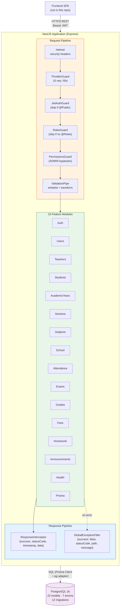
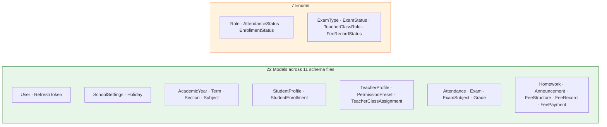
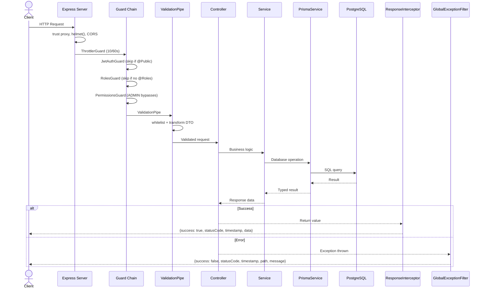

# System Overview

## High-Level Architecture

**my-school-BE** is a monolithic NestJS REST API backend for a school management platform. It exposes a REST API under `/api/v1/*`, authenticates via JWT (Passport), authorizes through role + permission guards, and persists to PostgreSQL via Prisma ORM.



## Technology Stack

### Core Runtime

| Technology | Version | Purpose |
|---|---|---|
| Node.js | 18+ | Runtime (required by NestJS 11) |
| TypeScript | 5.7.3 | Strict mode, path aliases (`@common/`, `@config/`, `@modules/`) |
| NestJS | 11.0.1 | Framework (Express platform) |
| pnpm | — | Package manager |

### Data Layer

| Technology | Version | Purpose |
|---|---|---|
| Prisma | 7.7.0 | ORM with multi-file schema (`prisma/schema/*.prisma`) |
| @prisma/adapter-pg | — | PostgreSQL adapter for Prisma |
| PostgreSQL | 16 | Primary database (Docker Compose for dev) |
| pg | 8.19.0 | Node.js PostgreSQL driver |

### Authentication & Security

| Technology | Version | Purpose |
|---|---|---|
| Passport + passport-jwt | 0.7 / 4.0.1 | JWT strategy implementation |
| @nestjs/jwt | 11.0.2 | Token signing/verification |
| bcrypt | 6.0.0 | Password hashing (12 salt rounds) |
| helmet | 8.1.0 | Security HTTP headers |
| @nestjs/throttler | 6.5.0 | Rate limiting (global: 10 req/60s) |

### Validation & Docs

| Technology | Version | Purpose |
|---|---|---|
| class-validator | 0.15.1 | DTO validation decorators |
| class-transformer | 0.5.1 | DTO transformation |
| zod | 4.3.6 | Environment variable validation only |
| @nestjs/swagger | 11.2.6 | OpenAPI docs at `/api/docs` (non-prod) |

### Dev & Testing

| Technology | Version | Purpose |
|---|---|---|
| Jest | 30 | Test runner |
| supertest | — | HTTP integration tests |
| ESLint | 9 | Linting |
| Prettier | — | Code formatting |
| husky | — | Git hooks (via `prepare` script) |

## Bootstrap Configuration

Source: `src/main.ts`

| Setting | Value |
|---|---|
| Platform | `NestExpressApplication` (Express) |
| Port | `configService.get<number>("app.port")`, fallback `3000` |
| Global prefix | `api/v1` |
| Trust proxy | Enabled (`app.set("trust proxy", 1)`) |
| CORS | Production: disabled. Non-production: origin `"*"`, methods GET/POST/PUT/PATCH/DELETE |
| Swagger | Non-production only at `/api/docs`, bearer auth configured |

### Global Providers (registered in `app.module.ts`)

| Type | Class | Purpose |
|---|---|---|
| Strategy | `JwtStrategy` | Validates access tokens, loads user from DB |
| Strategy | `JwtFirstLoginStrategy` | Validates first-login tokens |
| APP_GUARD | `JwtAuthGuard` | Global auth — skipped by `@Public()` |
| APP_GUARD | `RolesGuard` | Role check — skipped if no `@Roles()` |
| APP_GUARD | `PermissionsGuard` | Permission check — ADMIN bypasses |
| APP_GUARD | `ThrottlerGuard` | Rate limiting (10 req/60s) |

## Project Structure

```
my-school-BE/
├── src/
│   ├── main.ts                          # Bootstrap
│   ├── app.module.ts                    # Root module (18 imports, 6 providers)
│   ├── common/                          # Shared infrastructure
│   │   ├── constants/                   # App constants
│   │   ├── decorators/                  # @CurrentUser, @Permissions, @Public, @Roles
│   │   ├── filters/                     # GlobalExceptionFilter
│   │   ├── guards/                      # JwtAuth, JwtFirstLogin, Roles, Permissions
│   │   ├── interceptors/                # ResponseInterceptor
│   │   ├── pipes/                       # (empty)
│   │   └── utils/                       # password.util.ts (bcrypt wrapper)
│   ├── config/                          # app.config, jwt.config, env validation (zod)
│   └── modules/                         # 16 feature modules
│       ├── auth/                        # Login, refresh, logout, change-password
│       ├── users/                       # User CRUD (admin)
│       ├── teachers/                    # Profiles, presets, class assignments
│       ├── students/                    # Profiles, enrollment, promotion
│       ├── academic-years/              # Years + terms management
│       ├── sections/                    # Class sections per year
│       ├── subjects/                    # Subject registry
│       ├── school/                      # Settings, holidays, weekly-off
│       ├── attendance/                  # Mark + query attendance
│       ├── exams/                       # Exam lifecycle + subjects
│       ├── grades/                      # Grade entry + summaries
│       ├── fees/                        # Structures, records, payments
│       ├── homework/                    # Assignment management
│       ├── announcements/               # Announcements CRUD
│       ├── health/                      # Health check (@nestjs/terminus)
│       └── prisma/                      # PrismaService (@Global)
├── prisma/
│   ├── schema/                          # 11 multi-file schema files
│   │   ├── base.prisma                  # Datasource + generator config
│   │   ├── user.prisma                  # User, RefreshToken
│   │   ├── school.prisma                # SchoolSettings, Holiday
│   │   ├── academic.prisma              # AcademicYear, Term, Section, Subject
│   │   ├── student.prisma               # StudentProfile, StudentEnrollment
│   │   ├── teacher.prisma               # TeacherProfile, PermissionPreset, Assignment
│   │   ├── attendance.prisma            # Attendance
│   │   ├── exam.prisma                  # Exam, ExamSubject, Grade
│   │   ├── homework.prisma              # Homework
│   │   ├── announcement.prisma          # Announcement
│   │   └── fees.prisma                  # FeeStructure, FeeRecord, FeePayment
│   └── migrations/                      # 12 migrations (2026-03 through 2026-09)
├── docker-compose.yml                   # PostgreSQL 16 (dev only)
├── deployment/                          # 13 platform deployment guides
├── package.json                         # 26 runtime + 31 dev dependencies, 27 scripts
├── tsconfig.json                        # ES2021, strict, path aliases
└── nest-cli.json                        # deleteOutDir, tsconfig.build.json
```

## Module Pattern

Every domain module follows a consistent structure:

```
modules/<name>/
├── <name>.module.ts          # NestJS module declaration
├── <name>.controller.ts      # Route handlers
├── <name>.service.ts         # Business logic (injects PrismaService)
├── <name>.types.ts           # TypeScript interfaces and types
├── dto/                      # Request/response DTOs with class-validator
│   ├── create-<name>.dto.ts
│   ├── update-<name>.dto.ts
│   └── ...
├── <name>.service.spec.ts    # Unit tests (9 of 16 modules)
└── index.ts                  # Barrel exports
```

**Exceptions**: `health` has no service (uses `@nestjs/terminus`). `prisma` has only service + module.

## Database Schema



**Migrations**: 12 migrations from `2026-03-11_init` through `2026-09-08_rename_class_to_section`.

## Environment Variables

Source: `.env.example`

| Variable | Example | Purpose |
|---|---|---|
| `NODE_ENV` | `development` | Environment mode (controls CORS, Swagger) |
| `PORT` | `3000` | Server port |
| `DATABASE_URL` | `postgresql://...` | PostgreSQL connection string |
| `JWT_ACCESS_SECRET` | — | Access token signing key |
| `JWT_REFRESH_SECRET` | — | Refresh token signing key |
| `JWT_ACCESS_EXPIRES_IN` | `15m` | Access token TTL |
| `JWT_REFRESH_EXPIRES_IN` | `7d` | Refresh token TTL |

Validated at startup using **zod** (`src/config/env.validation.ts`).

## Request Lifecycle



## Deployment Model

**FACT**: No Dockerfile exists in the repository.

| Mode | How | Database |
|---|---|---|
| Development | `pnpm start:dev` (NestJS watch mode) | Docker Compose: `postgres:16-alpine` on port 5432 |
| Production | `pnpm build` → `node dist/main` | External PostgreSQL (migrations run separately) |

The `deployment/` directory contains 13 platform-specific guides, but notes the missing Dockerfile as a prerequisite.

## External Dependencies

The application has **zero external integrations** — it is a self-contained CRUD API backed by PostgreSQL:

- No message queues or event buses
- No external notification services (email, SMS, push)
- No file storage (S3, CDN)
- No third-party API calls (`@nestjs/axios` declared but unused)
- No caching layer (Redis, Memcached)
- No background job processing
- Single database, single application instance

## Test Coverage

| Status | Modules (9 tested / 7 untested) |
|---|---|
| **Has tests** | academic-years, attendance, auth, school, sections, students, subjects, teachers, users |
| **No tests** | announcements, exams, fees, grades, health, homework, prisma |
