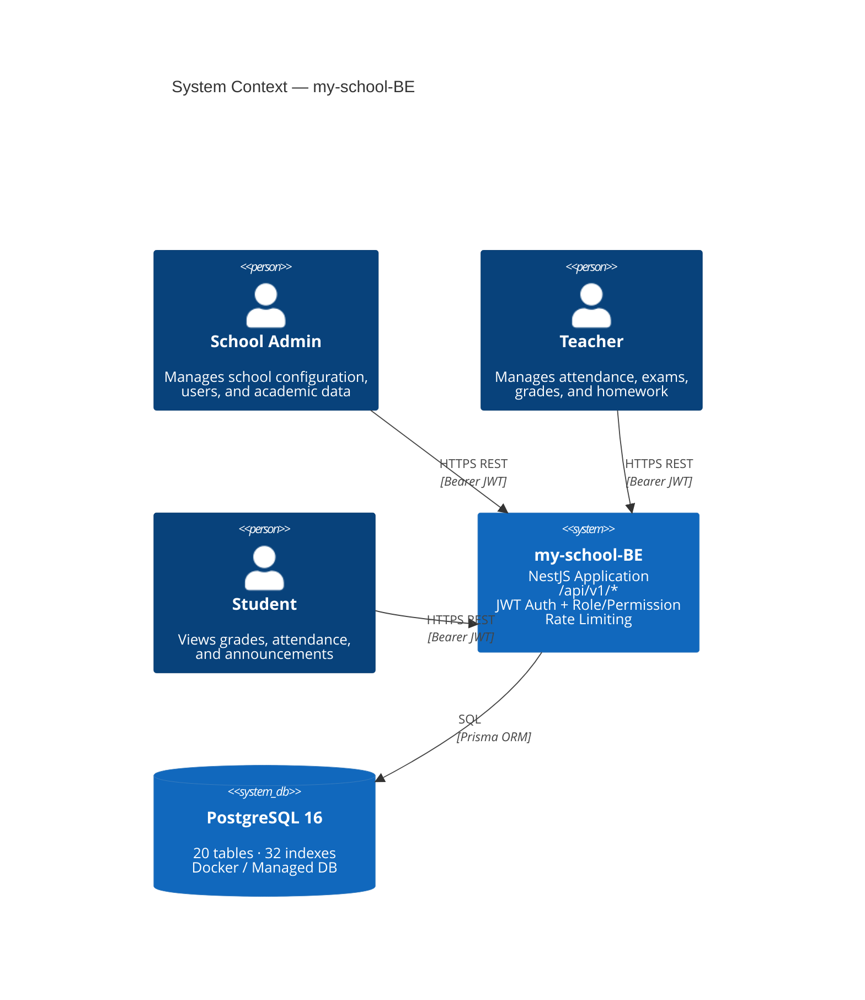
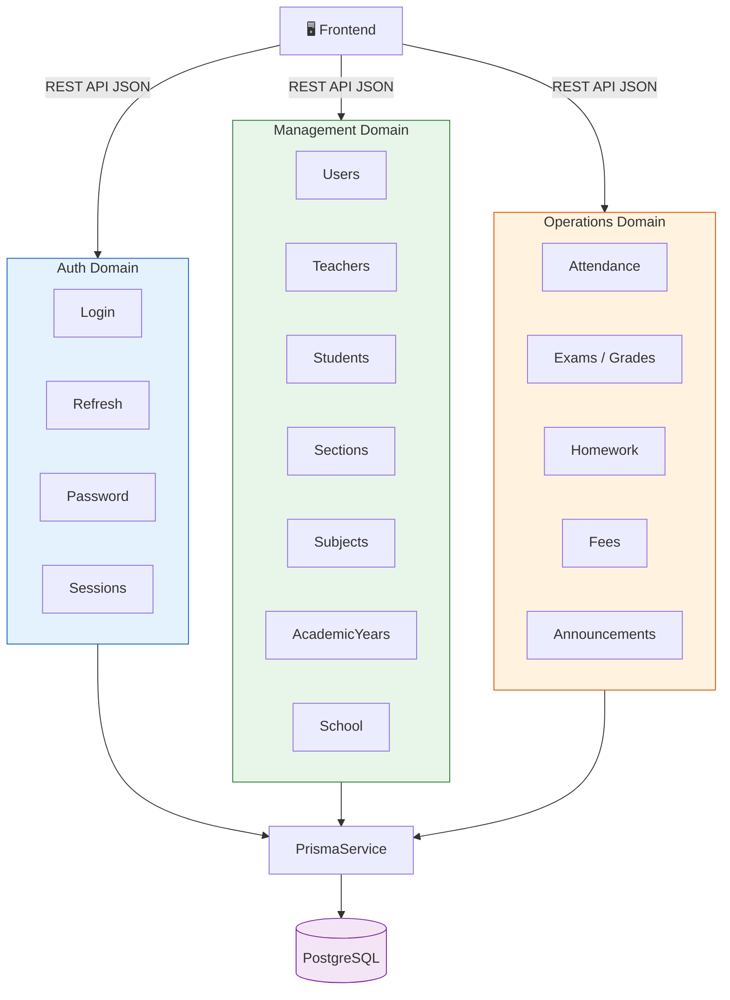

# Architecture Diagrams

## System Context

**Key boundaries**:
- No external API integrations
- No message queues or async processing
- No file storage or CDN
- No caching layer
- Single database, single application instance

## Security Boundary Diagram

```mermaid
graph TD
    subgraph Public["🔓 PUBLIC ZONE"]
        Login["POST /auth/login<br/>rate: 5/min"]
        Refresh["POST /auth/refresh<br/>rate: 10/min"]
        ChangePass["POST /auth/change-password<br/>JwtChangePasswordGuard"]
        Health["GET /health<br/>no auth"]
    end

    Public -->|JwtAuthGuard| Authenticated

    subgraph Authenticated["🔑 AUTHENTICATED ZONE (any role)"]
        CurrentYear["GET /academic-years/current"]
        SectionsRead["GET /sections"]
        SubjectsRead["GET /subjects"]
        Holidays["GET /school/holidays"]
        AnnouncementsRead["GET /announcements"]
        Me["GET /auth/me"]
        Logout["POST /auth/logout"]
    end

    Authenticated -->|RolesGuard| RoleRestricted

    subgraph RoleRestricted["👤 ROLE-RESTRICTED ZONE"]
        direction LR
        AdminTeacher["ADMIN + TEACHER:<br/>attendance, exams, grades,<br/>homework, announcements<br/>(with @Permissions)"]
        AdminOnly["ADMIN ONLY:<br/>users CRUD, school settings,<br/>exam unlock/discard,<br/>promote, teacher presets"]
    end

    RoleRestricted -->|PermissionsGuard| PermRestricted

    subgraph PermRestricted["🛡️ PERMISSION-RESTRICTED ZONE"]
        ATTENDANCE_WRITE["ATTENDANCE_WRITE<br/>POST /attendance/mark"]
        ATTENDANCE_READ["ATTENDANCE_READ<br/>GET /attendance"]
        GRADES_WRITE["GRADES_WRITE<br/>POST exams, grades, finalize"]
        GRADES_READ["GRADES_READ<br/>GET /grades/summary"]
        FEES_MANAGE["FEES_MANAGE<br/>fee structures, payments"]
        HOMEWORK_MANAGE["HOMEWORK_MANAGE<br/>POST/PATCH/DELETE homework"]
        ANNOUNCEMENTS_MANAGE["ANNOUNCEMENTS_MANAGE<br/>POST/PATCH/DELETE"]
        SECTION_MANAGE["SECTION_MANAGE<br/>POST/PATCH sections"]
        SUBJECT_MANAGE["SUBJECT_MANAGE<br/>POST/PATCH subjects"]
        ACADEMIC_YEAR_MANAGE["ACADEMIC_YEAR_MANAGE<br/>POST/PATCH academic-years"]
    end

    note["Note: ADMIN bypasses<br/>all permission checks"]

    style Public fill:#e8f5e9,stroke:#4caf50
    style Authenticated fill:#fff8e1,stroke:#ff8f00
    style RoleRestricted fill:#fff3e0,stroke:#e65100
    style PermRestricted fill:#fce4ec,stroke:#c62828
```

## Data Flow Diagram

