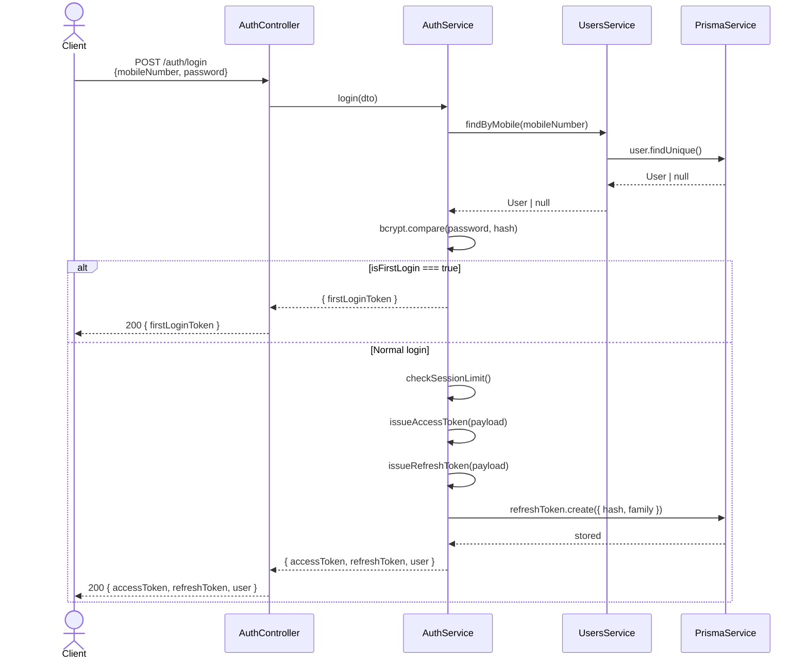
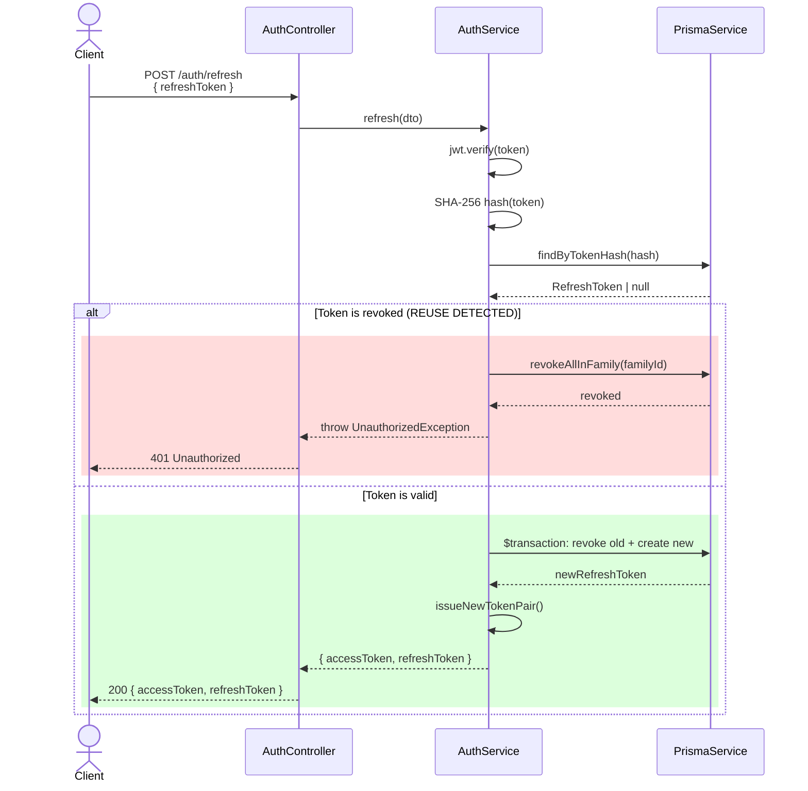
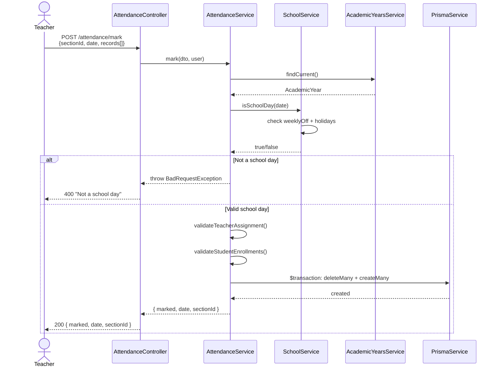
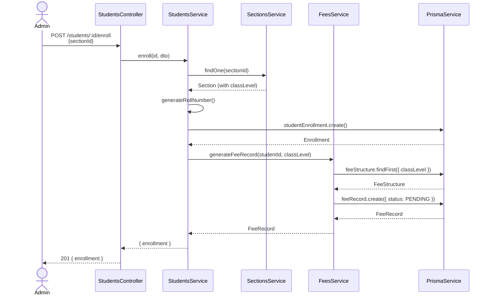

# Behavioral Diagrams

## Authentication Flow — Login

```mermaid
sequenceDiagram
    actor Client
    participant AC as AuthController
    participant AS as AuthService
    participant US as UsersService
    participant DB as PrismaService

    Client->>AC: POST /auth/login<br/>{mobileNumber, password}
    AC->>AS: login(dto)
    AS->>US: findByMobile(mobileNumber)
    US->>DB: user.findUnique()
    DB-->>US: User | null
    US-->>AS: User | null

    AS->>AS: bcrypt.compare(password, hash)

    alt isFirstLogin === true
        AS-->>AC: { firstLoginToken }
        AC-->>Client: 200 { firstLoginToken }
    else Normal login
        AS->>AS: checkSessionLimit()
        AS->>AS: issueAccessToken(payload)
        AS->>AS: issueRefreshToken(payload)
        AS->>DB: refreshToken.create({ hash, family })
        DB-->>AS: stored
        AS-->>AC: { accessToken, refreshToken, user }
        AC-->>Client: 200 { accessToken, refreshToken, user }
    end
```

## Token Refresh with Reuse Detection

```mermaid
sequenceDiagram
    actor Client
    participant AC as AuthController
    participant AS as AuthService
    participant DB as PrismaService

    Client->>AC: POST /auth/refresh<br/>{ refreshToken }
    AC->>AS: refresh(dto)
    AS->>AS: jwt.verify(token)
    AS->>AS: SHA-256 hash(token)
    AS->>DB: findByTokenHash(hash)
    DB-->>AS: RefreshToken | null

    alt Token is revoked (REUSE DETECTED)
        rect rgb(255, 220, 220)
            AS->>DB: revokeAllInFamily(familyId)
            DB-->>AS: revoked
            AS-->>AC: throw UnauthorizedException
            AC-->>Client: 401 Unauthorized
        end
    else Token is valid
        rect rgb(220, 255, 220)
            AS->>DB: $transaction: revoke old + create new
            DB-->>AS: newRefreshToken
            AS->>AS: issueNewTokenPair()
            AS-->>AC: { accessToken, refreshToken }
            AC-->>Client: 200 { accessToken, refreshToken }
        end
    end
```

## Attendance Marking Flow

```mermaid
sequenceDiagram
    actor Teacher
    participant AC as AttendanceController
    participant AS as AttendanceService
    participant SS as SchoolService
    participant AYS as AcademicYearsService
    participant DB as PrismaService

    Teacher->>AC: POST /attendance/mark<br/>{sectionId, date, records[]}
    AC->>AS: mark(dto, user)
    AS->>AYS: findCurrent()
    AYS-->>AS: AcademicYear

    AS->>SS: isSchoolDay(date)
    SS->>SS: check weeklyOff + holidays
    SS-->>AS: true/false

    alt Not a school day
        AS-->>AC: throw BadRequestException
        AC-->>Teacher: 400 "Not a school day"
    else Valid school day
        AS->>AS: validateTeacherAssignment()
        AS->>AS: validateStudentEnrollments()
        AS->>DB: $transaction: deleteMany + createMany
        DB-->>AS: created
        AS-->>AC: { marked, date, sectionId }
        AC-->>Teacher: 200 { marked, date, sectionId }
    end
```

## Student Enrollment + Fee Generation

```mermaid
sequenceDiagram
    actor Admin
    participant SC as StudentsController
    participant SS as StudentsService
    participant SEC as SectionsService
    participant FS as FeesService
    participant DB as PrismaService

    Admin->>SC: POST /students/:id/enroll<br/>{sectionId}
    SC->>SS: enroll(id, dto)
    SS->>SEC: findOne(sectionId)
    SEC-->>SS: Section (with classLevel)

    SS->>SS: generateRollNumber()
    SS->>DB: studentEnrollment.create()
    DB-->>SS: Enrollment

    SS->>FS: generateFeeRecord(studentId, classLevel)
    FS->>DB: feeStructure.findFirst({ classLevel })
    DB-->>FS: FeeStructure
    FS->>DB: feeRecord.create({ status: PENDING })
    DB-->>FS: FeeRecord
    FS-->>SS: FeeRecord

    SS-->>SC: { enrollment }
    SC-->>Admin: 201 { enrollment }
```
