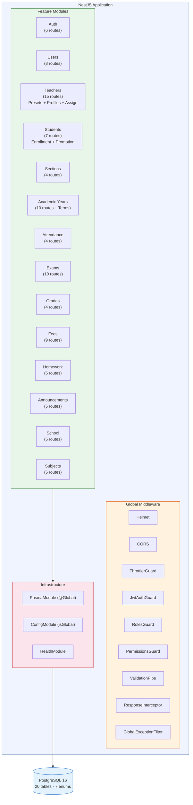
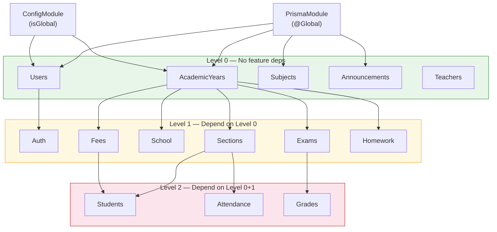
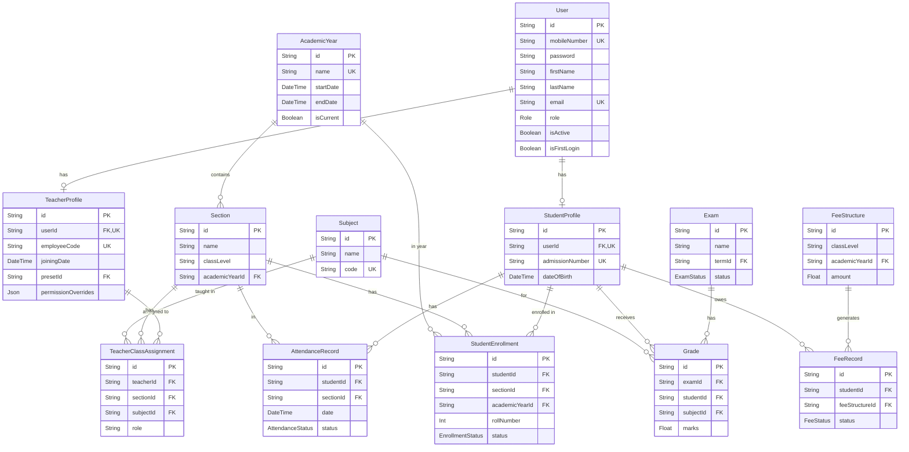

# Structural Diagrams

## System Component Diagram

```mermaid
graph TB
    subgraph NestJS["NestJS Application"]
        subgraph Middleware["Global Middleware"]
            Helmet
            CORS
            ThrottlerGuard
            JwtAuthGuard
            RolesGuard
            PermissionsGuard
            ValidationPipe
            ResponseInterceptor
            GlobalExceptionFilter
        end

        subgraph Features["Feature Modules"]
            Auth["Auth<br/>(6 routes)"]
            Users["Users<br/>(8 routes)"]
            Teachers["Teachers<br/>(15 routes)<br/>Presets + Profiles + Assign"]
            Students["Students<br/>(7 routes)<br/>Enrollment + Promotion"]
            Sections["Sections<br/>(4 routes)"]
            AcademicYears["Academic Years<br/>(10 routes + Terms)"]
            Attendance["Attendance<br/>(4 routes)"]
            Exams["Exams<br/>(10 routes)"]
            Grades["Grades<br/>(4 routes)"]
            Fees["Fees<br/>(9 routes)"]
            Homework["Homework<br/>(5 routes)"]
            Announcements["Announcements<br/>(5 routes)"]
            School["School<br/>(5 routes)"]
            Subjects["Subjects<br/>(5 routes)"]
        end

        subgraph Infra["Infrastructure"]
            PrismaModule["PrismaModule (@Global)"]
            ConfigModule["ConfigModule (isGlobal)"]
            HealthModule["HealthModule"]
        end
    end

    Features --> Infra
    Infra --> DB[("PostgreSQL 16<br/>20 tables · 7 enums")]

    style NestJS fill:#f0f4ff,stroke:#4a6fa5
    style Middleware fill:#fff3e0,stroke:#e65100
    style Features fill:#e8f5e9,stroke:#2e7d32
    style Infra fill:#fce4ec,stroke:#c62828
    style DB fill:#e3f2fd,stroke:#1565c0
```

## Module Dependency Graph

```mermaid
graph TD
    Prisma["PrismaModule<br/>(@Global)"] --> Users
    Prisma --> AcademicYears
    Prisma --> Subjects
    Prisma --> Announcements
    Config["ConfigModule<br/>(isGlobal)"] --> Users
    Config --> AcademicYears

    subgraph Level0["Level 0 — No feature deps"]
        Users
        Teachers
        AcademicYears["AcademicYears"]
        Subjects
        Announcements
    end

    subgraph Level1["Level 1 — Depend on Level 0"]
        Auth
        Sections
        School
        Fees
        Exams
        Homework
    end

    subgraph Level2["Level 2 — Depend on Level 0+1"]
        Students
        Attendance
        Grades
    end

    Users --> Auth
    AcademicYears --> Sections
    AcademicYears --> School
    AcademicYears --> Fees
    AcademicYears --> Exams
    AcademicYears --> Homework
    Sections --> Students
    Fees --> Students
    Sections --> Attendance
    Exams --> Grades

    style Level0 fill:#e8f5e9,stroke:#388e3c
    style Level1 fill:#fff8e1,stroke:#f9a825
    style Level2 fill:#fce4ec,stroke:#c62828
```

## Database Entity Relationship Diagram

```mermaid
erDiagram
    User {
        String id PK
        String mobileNumber UK
        String password
        String firstName
        String lastName
        String email UK
        Role role
        Boolean isActive
        Boolean isFirstLogin
    }

    TeacherProfile {
        String id PK
        String userId FK,UK
        String employeeCode UK
        DateTime joiningDate
        String presetId FK
        Json permissionOverrides
    }

    StudentProfile {
        String id PK
        String userId FK,UK
        String admissionNumber UK
        DateTime dateOfBirth
    }

    TeacherClassAssignment {
        String id PK
        String teacherId FK
        String sectionId FK
        String subjectId FK
        String role
    }

    StudentEnrollment {
        String id PK
        String studentId FK
        String sectionId FK
        String academicYearId FK
        Int rollNumber
        EnrollmentStatus status
    }

    AcademicYear {
        String id PK
        String name UK
        DateTime startDate
        DateTime endDate
        Boolean isCurrent
    }

    Section {
        String id PK
        String name
        String classLevel
        String academicYearId FK
    }

    Subject {
        String id PK
        String name
        String code UK
    }

    Exam {
        String id PK
        String name
        String termId FK
        ExamStatus status
    }

    Grade {
        String id PK
        String examId FK
        String studentId FK
        String subjectId FK
        Float marks
    }

    FeeStructure {
        String id PK
        String classLevel
        String academicYearId FK
        Float amount
    }

    FeeRecord {
        String id PK
        String studentId FK
        String feeStructureId FK
        FeeStatus status
    }

    AttendanceRecord {
        String id PK
        String studentId FK
        String sectionId FK
        DateTime date
        AttendanceStatus status
    }

    User ||--o| TeacherProfile : "has"
    User ||--o| StudentProfile : "has"
    TeacherProfile ||--o{ TeacherClassAssignment : "assigned to"
    StudentProfile ||--o{ StudentEnrollment : "enrolled in"
    AcademicYear ||--o{ Section : "contains"
    Section ||--o{ StudentEnrollment : "has"
    Section ||--o{ TeacherClassAssignment : "has"
    Subject ||--o{ TeacherClassAssignment : "taught in"
    AcademicYear ||--o{ StudentEnrollment : "in year"
    Exam ||--o{ Grade : "has"
    StudentProfile ||--o{ Grade : "receives"
    Subject ||--o{ Grade : "for"
    FeeStructure ||--o{ FeeRecord : "generates"
    StudentProfile ||--o{ FeeRecord : "owes"
    StudentProfile ||--o{ AttendanceRecord : "has"
    Section ||--o{ AttendanceRecord : "in"
```
