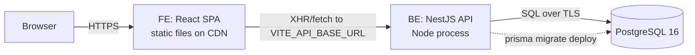

# 00 · Architecture Overview

## What we are deploying

Three independent pieces, deployed and scaled separately:

1. **Frontend** — a static bundle (`index.html` + JS/CSS). No server needed; served by
   any CDN/static host. Calls the API using the build-time variable `VITE_API_BASE_URL`.
2. **Backend** — a long-running Node process (NestJS). Needs a runtime, environment
   variables, and network access to the database.
3. **Database** — PostgreSQL 16, always-on, managed by a provider.

## Backend runtime facts (verified from the codebase)

| Property | Value | Source |
| -------- | ----- | ------ |
| Framework | NestJS 11 | `package.json` |
| ORM | Prisma 7 (`@prisma/client`, `@prisma/adapter-pg`) | `package.json` |
| Node build output | `dist/main.js` | `nest build` |
| Start command | `node dist/main` (via `pnpm start:prod`) | `package.json` scripts |
| Listen port | `PORT` env, default `3000` | `src/main.ts` |
| Global route prefix | `api/v1` | `src/main.ts` |
| Health endpoint | `GET /api/v1/health` | `src/main.ts`, health module |
| API docs (Swagger) | `GET /api/docs` — **disabled when `NODE_ENV=production`** | `src/main.ts` |
| Security headers | `helmet()` enabled | `src/main.ts` |
| Proxy trust | `trust proxy = 1` (works behind a reverse proxy/LB) | `src/main.ts` |
| Package manager | **pnpm** (`pnpm-lock.yaml`) | repo |

## Request flow in production

1. User loads the FE URL → CDN returns static SPA.
2. SPA boots and calls `${VITE_API_BASE_URL}` (e.g. `https://api.example.com/api/v1`).
3. The API validates the JWT, runs business logic, and queries Postgres via Prisma.
4. Responses are wrapped by a global response interceptor and returned as JSON.

## What each environment needs

| Environment | FE | BE | DB |
| ----------- | -- | -- | -- |
| Local dev | `vite` dev server (`:5173`) | `nest start --watch` (`:3000`) | Docker Postgres (`docker-compose.yml`) |
| Preview/staging | Preview deploy | Preview service | Branch DB or shared staging DB |
| Production | CDN static host | Always-on Node service | Managed Postgres |

## Networking & domains (typical)

| Piece | Example URL |
| ----- | ----------- |
| FE | `https://app.example.com` |
| BE | `https://api.example.com` (serves under `/api/v1`) |
| Swagger | Not exposed in production |

> **Note:** The FE talks to the BE **from the user's browser**, so the BE must be
> reachable on the public internet and must allow the FE's origin via CORS. Putting
> the BE "behind" the FE is not required, but the BE must present a valid TLS cert.

Continue to [Chapter 01 · Prerequisites](01-prerequisites.md).
