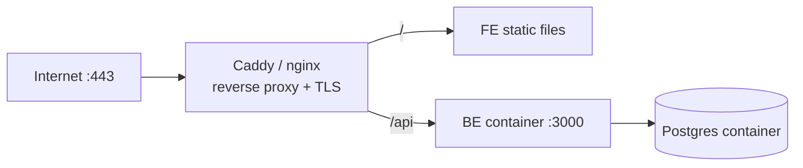

# Self-Hosted VPS + Docker Compose (Full Stack)

> **Model:** One Linux server you control (DigitalOcean, Hetzner, Linode, EC2, etc.)
> running everything via Docker Compose behind a reverse proxy with TLS. **Cost:** the
> VPS (~$4–6/mo for the smallest). **Cold start:** none. Maximum control, maximum ops.

## What runs on the box


## Prerequisites
- A VPS with a public IP and a domain pointing at it (A records for `app.` and `api.`).
- Docker + Docker Compose installed on the server.
- [Chapter 01](../01-prerequisites.md) BE Dockerfile present.

## 1. Compose file (production)
`docker-compose.prod.yml` on the server:

```yaml
services:
  db:
    image: postgres:16-alpine
    restart: unless-stopped
    environment:
      POSTGRES_USER: ${POSTGRES_USER}
      POSTGRES_PASSWORD: ${POSTGRES_PASSWORD}
      POSTGRES_DB: ${POSTGRES_DB}
    volumes:
      - pgdata:/var/lib/postgresql/data
    healthcheck:
      test: ["CMD-SHELL", "pg_isready -U ${POSTGRES_USER}"]
      interval: 10s
      timeout: 5s
      retries: 5

  api:
    build: ./my-school-BE          # or image: from your registry
    restart: unless-stopped
    depends_on:
      db:
        condition: service_healthy
    environment:
      NODE_ENV: production
      PORT: 3000
      DATABASE_URL: postgresql://${POSTGRES_USER}:${POSTGRES_PASSWORD}@db:5432/${POSTGRES_DB}?schema=public
      JWT_ACCESS_SECRET: ${JWT_ACCESS_SECRET}
      JWT_REFRESH_SECRET: ${JWT_REFRESH_SECRET}
      CORS_ORIGIN: https://app.example.com
    # Dockerfile CMD already runs: prisma migrate deploy && node dist/main
    expose:
      - "3000"

  caddy:
    image: caddy:2-alpine
    restart: unless-stopped
    ports:
      - "80:80"
      - "443:443"
    volumes:
      - ./Caddyfile:/etc/caddy/Caddyfile
      - ./fe-dist:/srv/fe          # built FE static files
      - caddy_data:/data
      - caddy_config:/config
    depends_on:
      - api

volumes:
  pgdata:
  caddy_data:
  caddy_config:
```

## 2. Reverse proxy + automatic TLS (Caddy)
`Caddyfile` — Caddy fetches Let's Encrypt certs automatically:

```
api.example.com {
    reverse_proxy api:3000
}

app.example.com {
    root * /srv/fe
    encode gzip
    try_files {path} /index.html      # SPA fallback
    file_server
}
```

> **Note:** `try_files {path} /index.html` is the SPA fallback (equivalent to the
> `_redirects` rule on static hosts). nginx equivalent: `try_files $uri /index.html;`.

## 3. Build the FE and deploy files
```bash
# locally or in CI
cd my-school-FE
VITE_API_BASE_URL=https://api.example.com/api/v1 pnpm build
# copy dist/ to the server's ./fe-dist
rsync -av dist/ user@server:/opt/my-school/fe-dist/
```

## 4. Bring it up
```bash
# on the server, in /opt/my-school with a .env holding the secrets
docker compose -f docker-compose.prod.yml up -d --build
docker compose -f docker-compose.prod.yml logs -f api
```

## 5. Migrations & seeding
- Migrations run automatically via the Dockerfile `CMD` on `api` startup.
- Seed once: `docker compose exec api pnpm prisma:seed`.

## 6. Backups (you own this)
Cron on the host:
```bash
0 3 * * * docker compose -f /opt/my-school/docker-compose.prod.yml exec -T db \
  pg_dump -U "$POSTGRES_USER" "$POSTGRES_DB" | gzip > /opt/backups/db-$(date +\%F).sql.gz
```

## Hardening checklist
- [ ] UFW firewall: allow only 22, 80, 443.
- [ ] SSH keys only (disable password login).
- [ ] `.env` file `chmod 600`, never committed.
- [ ] Auto-updates for the OS; pin image tags.
- [ ] Off-box backup copy (S3/rsync to another host).
- [ ] Fail2ban / rate limits at the proxy.

## Pros / Cons
| Pros | Cons |
| ---- | ---- |
| Total control, no cold starts | You are the ops team (patching, backups, uptime) |
| Cheapest always-on for full stack | Single box = single point of failure |
| Everything in one place | Manual scaling/HA |

## Cost
- Smallest VPS: ~$4–6/mo all-in (BE + FE + DB on one box).
