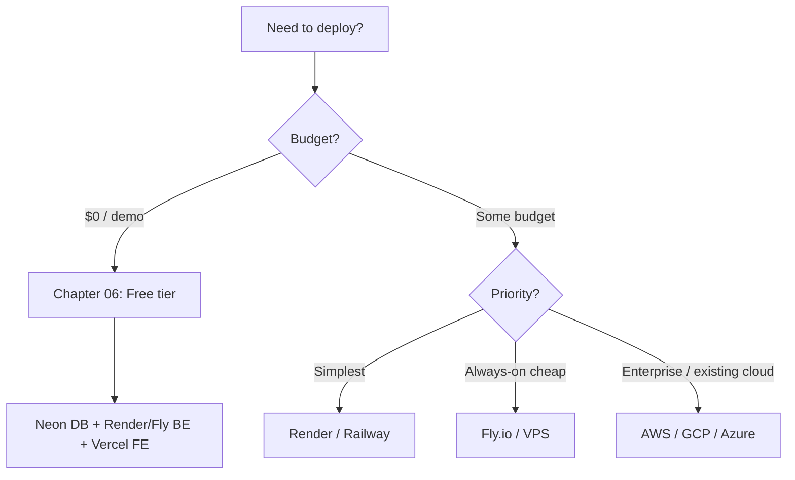

# Deployment Guide — my-school (Backend)

> This directory is a **self-contained, end-to-end deployment handbook** for the
> `my-school` platform. It is intentionally separate from `docs/` and uses its own
> format: numbered chapters, task blocks, callouts, and copy-paste commands.

The platform has two deployable units:

| Unit | Repo | Tech | Artifact | Runtime |
| ---- | ---- | ---- | -------- | ------- |
| **Backend (BE)** | `my-school-BE` | NestJS 11 + Prisma 7 | `dist/` Node server | Long-running Node process |
| **Frontend (FE)** | `my-school-FE` | React 19 + Vite 8 | `dist/` static files | Static host / CDN |
| **Database** | — | PostgreSQL 16 | Managed instance | Always-on |

The FE guide lives in `my-school-FE/deployment/`. This BE guide is the source of
truth for the API, database, and migrations; it cross-links to the FE where relevant.

---

## How to read this guide

Read top-to-bottom the first time. Each chapter goes **small → big**: it starts with
the simplest possible action, then layers on production concerns.

| # | Chapter | Read when |
| - | ------- | --------- |
| [00](00-overview.md) | Architecture overview | Always first |
| [01](01-prerequisites.md) | Prerequisites & required code fixes | **Before any deploy** |
| [02](02-environment-variables.md) | Environment variables reference | Setting up any environment |
| [03](03-database.md) | Database providers & setup | Provisioning Postgres |
| [04](04-migrations-seeding.md) | Migrations & seeding | Every release |
| [05](05-repo-strategy.md) | Repo strategy (mono vs separate) | Deciding structure |
| [06](06-free-tier.md) | Free-tier deployment (recommended) | Demo / MVP |
| [07](07-platforms/) | Every platform, step-by-step | Choosing a host |
| [08](08-cicd.md) | CI/CD with GitHub Actions | Automating deploys |
| [09](09-secrets-config.md) | Secrets management | Handling credentials |
| [10](10-post-deploy-checklist.md) | Post-deploy checklist | After first deploy |
| [11](11-monitoring-logging.md) | Monitoring & logging | Going live |
| [12](12-cost-comparison.md) | Cost comparison | Budgeting |
| [13](13-troubleshooting.md) | Troubleshooting | When things break |

---

## Callout legend

> **Note:** helpful context.

> **Warning:** skipping this will break the deploy.

> **Cost:** money implications.

> **Time:** rough effort estimate.

---

## The 60-second decision

**TL;DR recommendation for a demo:** Neon (DB) + Render or Fly.io (BE) + Vercel or
Cloudflare Pages (FE), all on free tiers. See [Chapter 06](06-free-tier.md).

---

## Before you deploy anything

Three code changes are **required** for a working production deploy. They are not yet
in the codebase and are documented in [Chapter 01](01-prerequisites.md):

1. Add a **Dockerfile** (BE has `.dockerignore` but no Dockerfile).
2. Fix **CORS** — production currently blocks all browser origins.
3. Point `DATABASE_URL` at a **managed Postgres** (local Docker is dev-only).

> **Warning:** Deploying without the CORS fix will make the FE unable to call the API
> even though both are "up".
