# My School Backend — Architecture Documentation

> **Purpose:** Comprehensive system architecture reference for onboarding, KT sessions, and AI agent context.
> **Stack:** NestJS 11 · TypeScript · PostgreSQL 16 · Prisma ORM · JWT Auth · Docker

---

## 1. High-Level System Architecture

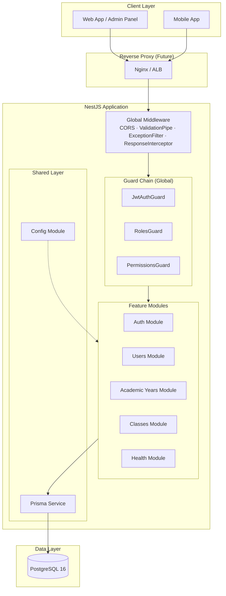

---

## 2. Module Dependency Graph

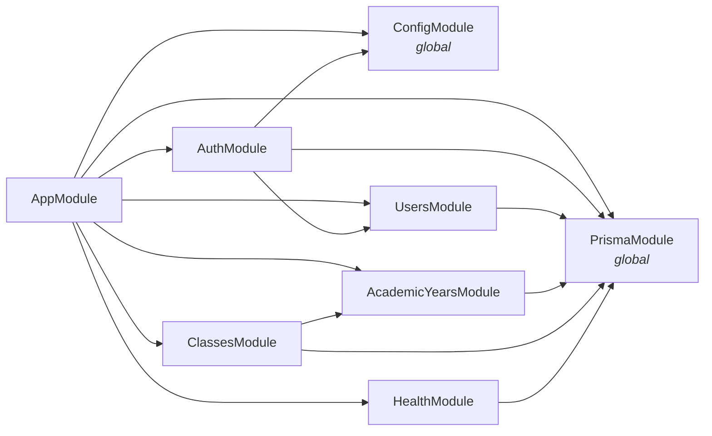

---

## 3. Authentication & Authorization Flow

### 3.1 Login Flow

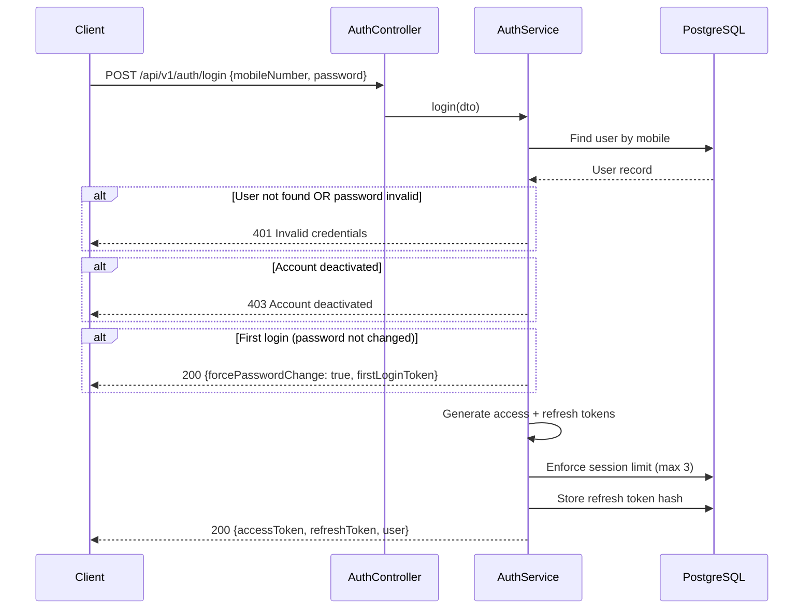

### 3.2 Token Refresh with Rotation & Reuse Detection

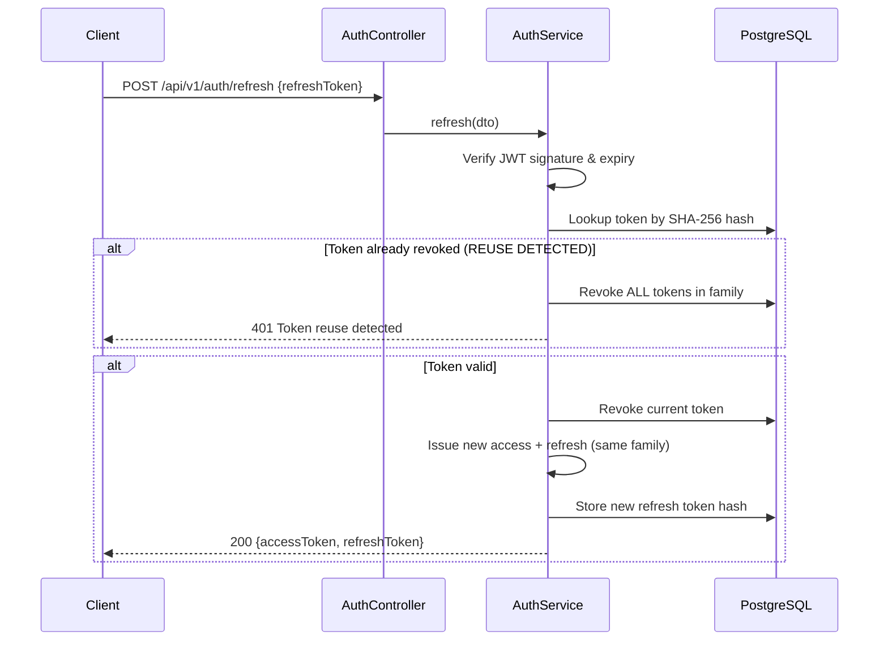

### 3.3 Guard Execution Order

```mermaid
flowchart TD
    REQ[Incoming Request] --> PUB{@Public decorator?}
    PUB -->|Yes| HANDLER[Route Handler]
    PUB -->|No| JWT[JwtAuthGuard<br/>Validate JWT signature & expiry]
    JWT -->|Invalid| R401[401 Unauthorized]
    JWT -->|Valid| STRAT[JwtStrategy<br/>Verify token type = access<br/>Check user active]
    STRAT -->|Fail| R401
    STRAT -->|Pass| ROLES{RolesGuard<br/>@Roles decorator present?}
    ROLES -->|No decorator| PERMS
    ROLES -->|Has roles| RCHK{User role in allowed list?}
    RCHK -->|No| R403[403 Forbidden]
    RCHK -->|Yes| PERMS{PermissionsGuard<br/>@Permissions decorator?}
    PERMS -->|No decorator| HANDLER
    PERMS -->|Has perms| ADMIN{Role = ADMIN?}
    ADMIN -->|Yes| HANDLER
    ADMIN -->|No| PCHK{User has ALL<br/>required permissions?}
    PCHK -->|No| R403
    PCHK -->|Yes| HANDLER
```

---

## 4. Database Entity Relationship Diagram

```mermaid
erDiagram
    User ||--o| TeacherProfile : "has"
    User ||--o| StudentProfile : "has"
    User ||--o{ RefreshToken : "owns"
    User ||--o{ User : "createdBy"

    TeacherProfile }o--o| PermissionPreset : "uses"
    TeacherProfile ||--o{ TeacherClassAssignment : "assigned"
    TeacherProfile ||--o{ Class : "classTeacher"

    StudentProfile ||--o{ StudentEnrollment : "enrolled"

    AcademicYear ||--o{ Class : "contains"
    AcademicYear ||--o{ Term : "contains"
    AcademicYear ||--o{ StudentEnrollment : "year"

    Class ||--o{ StudentEnrollment : "has"
    Class ||--o{ TeacherClassAssignment : "has"

    Subject ||--o{ TeacherClassAssignment : "taught"

    User {
        uuid id PK
        string mobileNumber UK
        string password
        string firstName
        string lastName
        string email UK
        Role role
        bool isActive
        bool isFirstLogin
        uuid createdById FK
    }

    TeacherProfile {
        uuid id PK
        uuid userId FK_UK
        string employeeCode UK
        datetime joiningDate
        uuid presetId FK
        string[] permissionOverrides
    }

    StudentProfile {
        uuid id PK
        uuid userId FK_UK
        string admissionNumber UK
        datetime dateOfBirth
    }

    RefreshToken {
        uuid id PK
        uuid userId FK
        string tokenHash UK
        string family
        bool isRevoked
        datetime expiresAt
    }

    PermissionPreset {
        uuid id PK
        string name UK
        string[] permissions
    }

    AcademicYear {
        uuid id PK
        string name UK
        datetime startDate
        datetime endDate
        bool isCurrent
    }

    Term {
        uuid id PK
        string name
        datetime startDate
        datetime endDate
        uuid academicYearId FK
    }

    Class {
        uuid id PK
        string name
        int gradeLevel
        uuid academicYearId FK
        uuid classTeacherId FK
    }

    Subject {
        uuid id PK
        string name
        string code
        int gradeLevel
    }

    StudentEnrollment {
        uuid id PK
        uuid studentId FK
        uuid classId FK
        uuid academicYearId FK
        string rollNumber
        EnrollmentStatus status
    }

    TeacherClassAssignment {
        uuid id PK
        uuid teacherId FK
        uuid classId FK
        uuid subjectId FK
        TeacherClassRole role
    }
```

---

## 5. Permission System

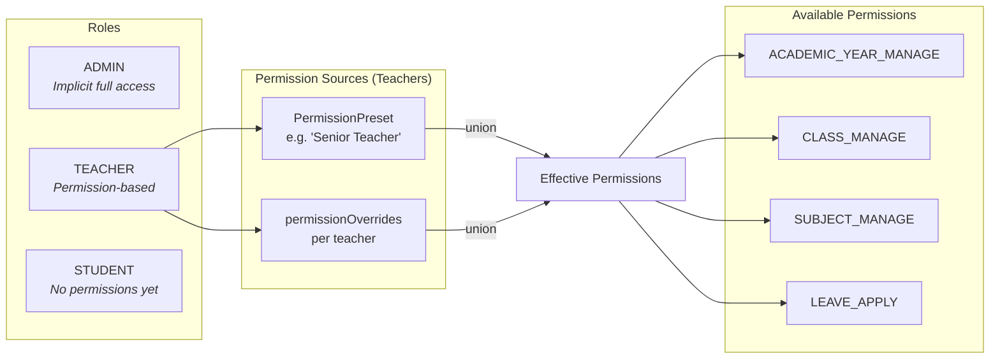

**Key rule:** Permissions are additive only. `permissionOverrides` adds to preset; to remove, change the preset itself.

---

## 6. Request/Response Lifecycle

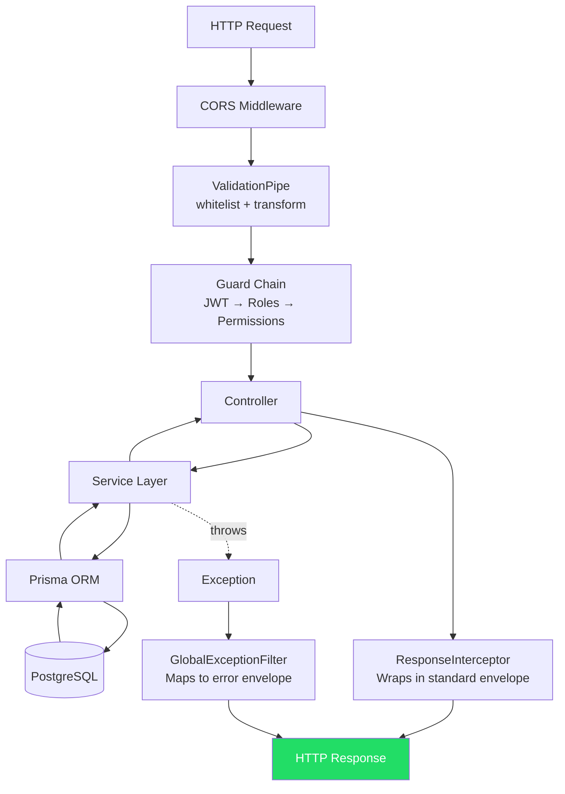

### Standard Response Envelope

```json
{
  "success": true,
  "statusCode": 200,
  "timestamp": "2026-05-05T10:30:00.000Z",
  "data": { ... }
}
```

### Error Response Envelope

```json
{
    "success": false,
    "statusCode": 401,
    "timestamp": "2026-05-05T10:30:00.000Z",
    "path": "/api/v1/auth/login",
    "message": "Invalid credentials"
}
```

---

## 7. API Route Map

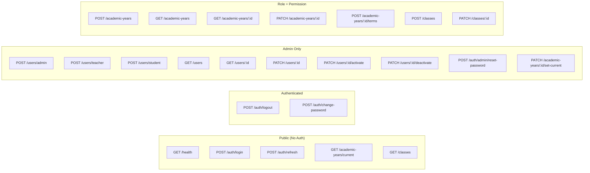

| Endpoint                          | Method | Auth                        | Roles          | Permission           |
| --------------------------------- | ------ | --------------------------- | -------------- | -------------------- |
| `/health`                         | GET    | Public                      | —              | —                    |
| `/auth/login`                     | POST   | Public                      | —              | —                    |
| `/auth/refresh`                   | POST   | Public                      | —              | —                    |
| `/auth/logout`                    | POST   | JWT                         | Any            | —                    |
| `/auth/change-password`           | POST   | JWT (access or first_login) | Any            | —                    |
| `/auth/admin/reset-password`      | POST   | JWT                         | ADMIN          | —                    |
| `/users/admin`                    | POST   | JWT                         | ADMIN          | —                    |
| `/users/teacher`                  | POST   | JWT                         | ADMIN          | —                    |
| `/users/student`                  | POST   | JWT                         | ADMIN          | —                    |
| `/users`                          | GET    | JWT                         | ADMIN          | —                    |
| `/users/:id`                      | GET    | JWT                         | ADMIN          | —                    |
| `/users/:id`                      | PATCH  | JWT                         | ADMIN          | —                    |
| `/users/:id/activate`             | PATCH  | JWT                         | ADMIN          | —                    |
| `/users/:id/deactivate`           | PATCH  | JWT                         | ADMIN          | —                    |
| `/academic-years`                 | POST   | JWT                         | ADMIN, TEACHER | ACADEMIC_YEAR_MANAGE |
| `/academic-years`                 | GET    | JWT                         | ADMIN, TEACHER | ACADEMIC_YEAR_MANAGE |
| `/academic-years/current`         | GET    | Public                      | —              | —                    |
| `/academic-years/:id`             | GET    | JWT                         | ADMIN, TEACHER | ACADEMIC_YEAR_MANAGE |
| `/academic-years/:id`             | PATCH  | JWT                         | ADMIN, TEACHER | ACADEMIC_YEAR_MANAGE |
| `/academic-years/:id/set-current` | PATCH  | JWT                         | ADMIN          | —                    |
| `/academic-years/:id/terms`       | POST   | JWT                         | ADMIN, TEACHER | ACADEMIC_YEAR_MANAGE |
| `/classes`                        | GET    | Public                      | —              | —                    |
| `/classes`                        | POST   | JWT                         | ADMIN, TEACHER | CLASS_MANAGE         |
| `/classes/:id`                    | GET    | JWT                         | Any            | —                    |
| `/classes/:id`                    | PATCH  | JWT                         | ADMIN, TEACHER | CLASS_MANAGE         |

---

## 8. Project Structure

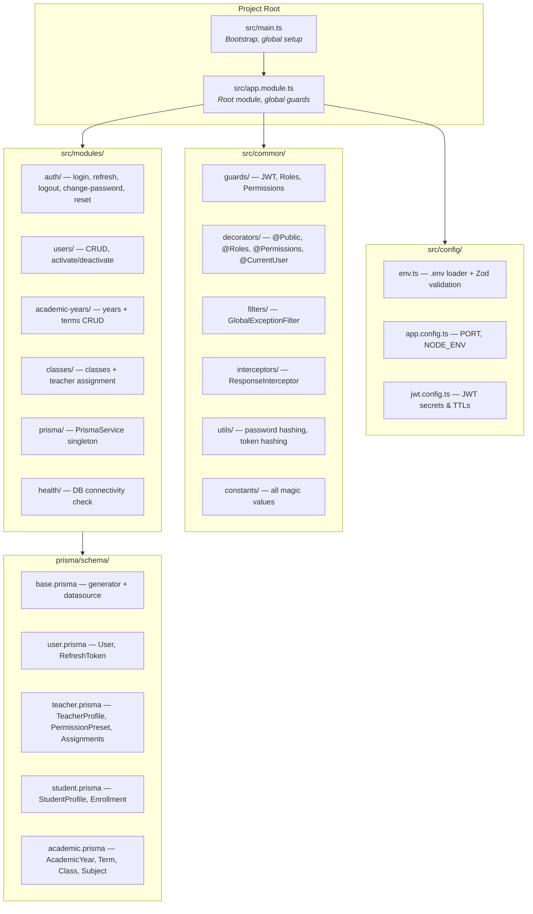

---

## 9. Token Architecture

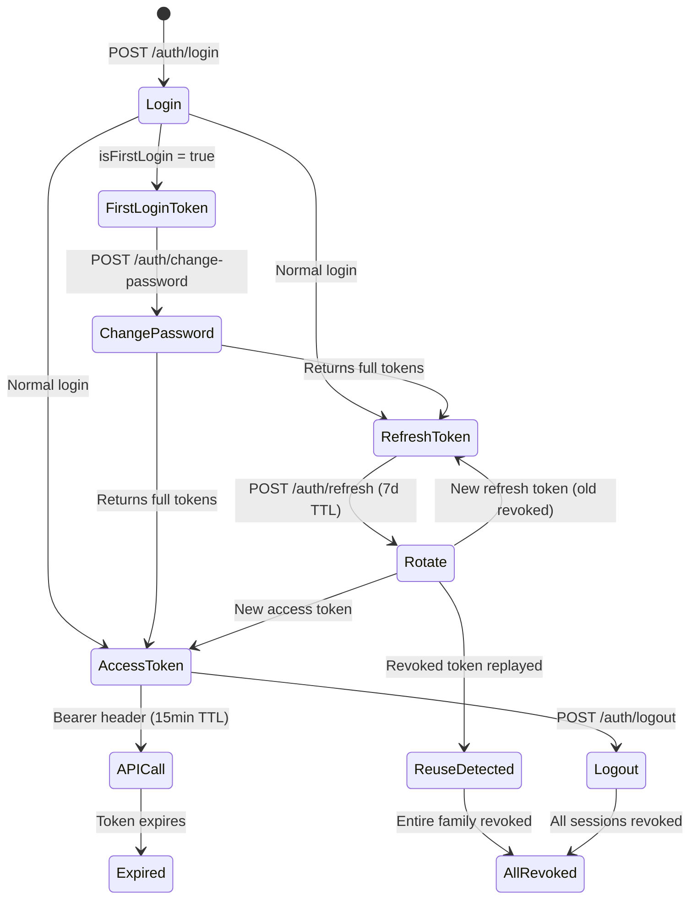

| Token Type    | TTL | Secret             | Storage            |
| ------------- | --- | ------------------ | ------------------ |
| `access`      | 15m | JWT_ACCESS_SECRET  | Client memory only |
| `first_login` | 15m | JWT_ACCESS_SECRET  | Client memory only |
| `refresh`     | 7d  | JWT_REFRESH_SECRET | SHA-256 hash in DB |

---

## 10. Session Management

- **Max active sessions:** 3 per user
- **Enforcement:** On login, if 3 active (non-revoked, non-expired) refresh tokens exist, the **oldest** is revoked
- **Family tracking:** Each login creates a new token family; rotations stay in the same family
- **Reuse detection:** If a revoked token from a family is presented, ALL tokens in that family are revoked (indicates token theft)

---

## 11. Environment & Configuration

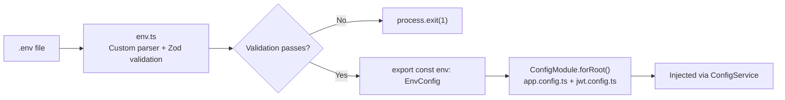

| Variable                 | Required | Default       | Description                           |
| ------------------------ | -------- | ------------- | ------------------------------------- |
| `NODE_ENV`               | Yes      | `development` | `development` / `production` / `test` |
| `PORT`                   | Yes      | `3000`        | Server port                           |
| `DATABASE_URL`           | Yes      | —             | PostgreSQL connection string          |
| `JWT_ACCESS_SECRET`      | Yes      | —             | HMAC secret for access tokens         |
| `JWT_REFRESH_SECRET`     | Yes      | —             | HMAC secret for refresh tokens        |
| `JWT_ACCESS_EXPIRES_IN`  | No       | `15m`         | Access token TTL                      |
| `JWT_REFRESH_EXPIRES_IN` | No       | `7d`          | Refresh token TTL                     |

---

## 12. Infrastructure

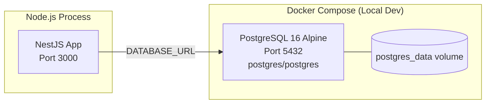

### Key Commands

| Command                    | Purpose                    |
| -------------------------- | -------------------------- |
| `pnpm db:start`            | Start PostgreSQL container |
| `pnpm prisma:migrate:dev`  | Run migrations (dev)       |
| `pnpm prisma:seed`         | Seed database              |
| `pnpm start:dev`           | Start with hot reload      |
| `pnpm build && pnpm start` | Production build + start   |

---

## 13. Error Handling Strategy

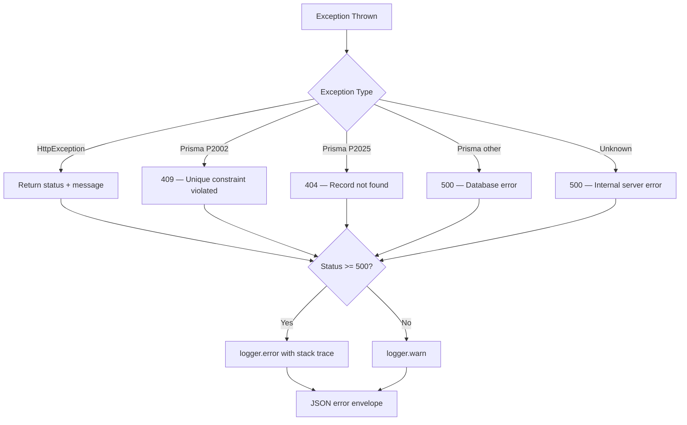

---

## 14. Data Flow Examples

### Creating a Teacher

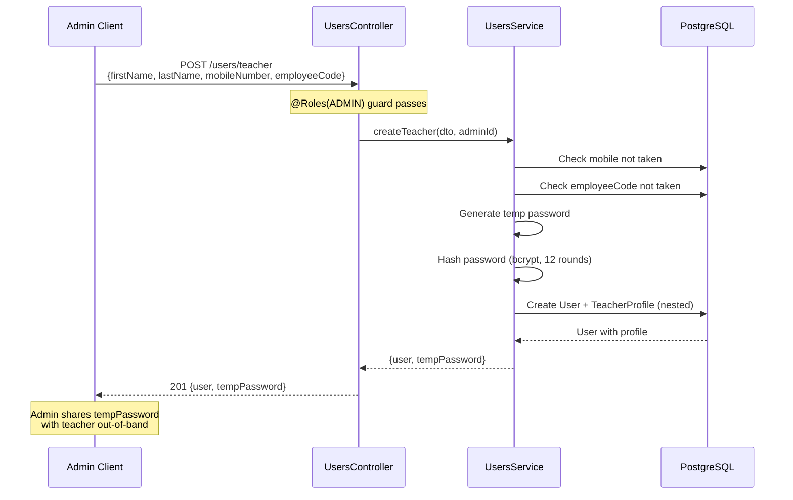

### First Login → Password Change

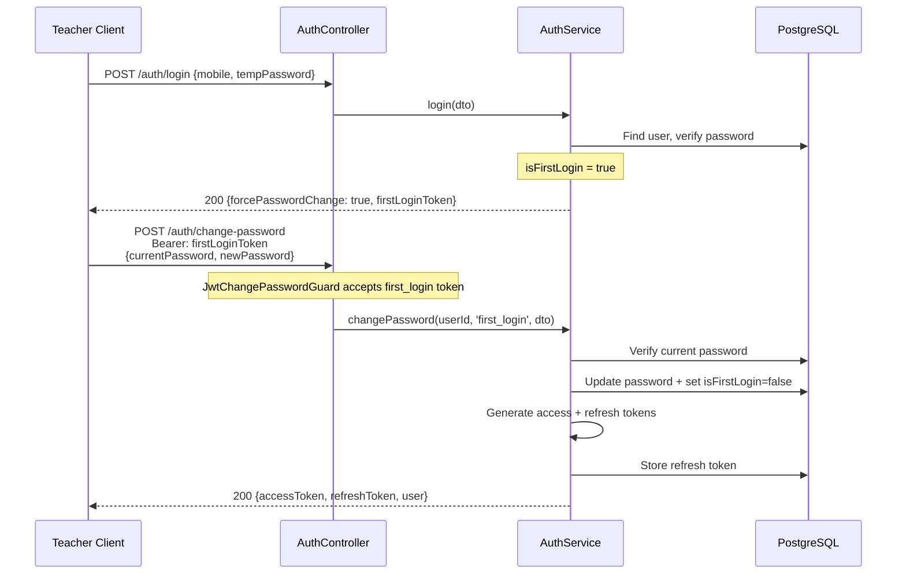

---

## 15. Known Limitations & Future Work

| Area                     | Current State                        | Recommended Fix                           |
| ------------------------ | ------------------------------------ | ----------------------------------------- |
| Rate limiting            | None                                 | Add `@nestjs/throttler` on auth endpoints |
| Temp password generation | Modulo bias in random char selection | Use `crypto.randomInt()`                  |
| User creation uniqueness | Check-then-act race condition        | Rely on DB constraint + handle P2002      |
| Term date validation     | No overlap detection between terms   | Add overlap check in service              |
| Tests                    | Scaffold only ("should be defined")  | Write integration + unit tests            |
| Permissions in JWT       | Stale for 15min after change         | Document tradeoff or add version check    |
| Unused deps              | `@nestjs/axios` installed but unused | Remove                                    |
| .env parsing             | Custom hand-rolled parser            | Replace with `dotenv.config()`            |

---

## 16. Enums Reference

```typescript
// User roles
enum Role {
    ADMIN,
    TEACHER,
    STUDENT,
}

// Teacher assignment types
enum TeacherClassRole {
    CLASS_TEACHER,
    SUBJECT_TEACHER,
}

// Student enrollment lifecycle
enum EnrollmentStatus {
    ACTIVE,
    PROMOTED,
    FAILED,
    TRANSFERRED,
    WITHDRAWN,
}
```

---

## 17. Security Measures

| Measure                 | Implementation                                                |
| ----------------------- | ------------------------------------------------------------- |
| Password hashing        | bcrypt with 12 salt rounds                                    |
| Token storage           | Only SHA-256 hash stored in DB, never raw token               |
| Token rotation          | Every refresh invalidates previous token                      |
| Reuse detection         | Replaying revoked token kills entire token family             |
| Session limiting        | Max 3 active sessions per user                                |
| Input validation        | class-validator + whitelist (strips unknown fields)           |
| First-login enforcement | Must change temp password before accessing system             |
| Permission isolation    | Students have no permissions; teachers get explicit grants    |
| Deactivation            | Deactivated users rejected at strategy level on every request |
